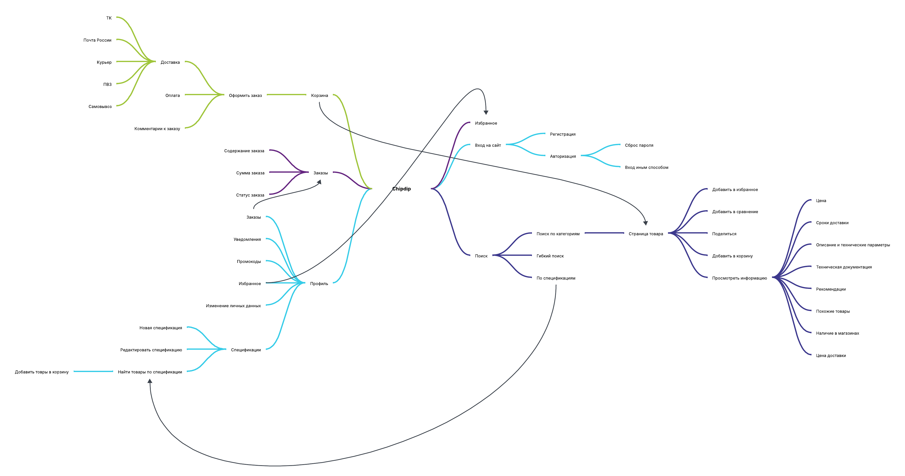
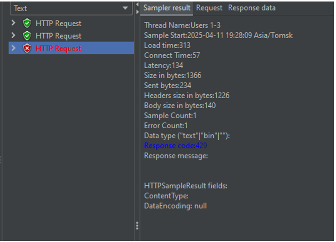

# Комплексный аудит системы https://www.chipdip.ru
Стек технологий: Python, Playwrigth, Apache JMeter, Google DevTools, Browserstack

## Ментальная карта системы

## Содержание работ
В ходе аудита было проведены:
1) Функциональное тестирование
2) Тестирование UI
3) Тестирование юзабилити
4) Кроссбраузерное тестирование
5) Нагрузочное тестирование

## Результаты:
### Функциональный аудит:
1) Не работает функция восстановления пароля с помощью электронной почты или телефона.  
Если запросить сброс пароля с помощью почты, то сообщение не пришло в течение двух недель, хотя было сделано несколько попыток в разное время.  
Если запросить восстановление пароля через телефон, то пишет "SMS успешно отправлено", но ничего не пришло, более того телефон не был зарегистрирован в системе.  

2) Не работает функция "Поделиться" через Viber и Skype, так как эти компании ушли с рынка РФ.  

### Аудит UI:
1) Если заходить на сайт с мобильного приложения, то никаким путем не удается найти раздел "Спецификации"  

### Юзабилити аудит
Успешно

### Кроссбраузерный аудит
Успешно

### Нагрузочное тестирование
Успешно, блокировка с ошибкой 429 (Слишком много запросов) происходила при отправке более 2 запросов в секунду  

 
